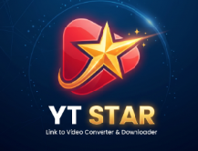

# 🌟 YTStar - Self-Hosted Video & Audio Downloader

> A fast, modern, **local-first** self-hosted web application for downloading videos and audio from YouTube and 1000+ supported platforms, powered by **FastAPI** and **yt-dlp**.


---

## 📸 App Preview



---

## 💡 Why Local-First / Self-Hosted?

Running YTStar **locally on your own PC** is the recommended way to use video downloaders. Here is why:

* 🛡️ **No Bot Detection / Rate Limits:** Public cloud providers (Render, Heroku, AWS) get flagged by YouTube rapidly with `429 Too Many Requests` or CAPTCHAs. Your local home IP avoids these blocks effortlessly.
* 🚀 **Unrestricted Speed & Storage:** Download high-bitrate 1080p, 4K videos or full playlists directly to your hard drive without cloud storage limits or bandwidth throttling.
* 🔒 **Complete Privacy:** Your media downloads, history, and configuration stay 100% private on your machine.

---

## ✨ Features

- 🎥 **Multi-Platform Support**: Download videos from YouTube, Vimeo, Twitter, TikTok, Instagram, and 1000+ other sites supported by `yt-dlp`.
- ⚡ **Real-Time Progress Tracking**: Live download speed, percentage, ETA, and status streaming via **Server-Sent Events (SSE)**.
- 🎵 **Audio Extraction**: Easily convert videos to high-quality MP3 / M4A audio files.
- ⚙️ **Quality Selection**: Choose specific video resolutions (1080p, 720p, 4K) or audio formats before downloading.
- 🌐 **Instant Public Sharing (Optional)**: Included `run_local.bat` / `run_local.ps1` sets up a secure **Cloudflare Tunnel**, giving you a shareable URL to access your app remotely from mobile devices without port forwarding!
- 🐳 **Docker & Cloud Ready**: Optional `Dockerfile` and `render.yaml` included for container labs and home servers.

---

## 🚀 Quick Start — Recommended (Windows 1-Click Setup)

Run YTStar locally on Windows in seconds:

1. Double-click **`run_local.bat`**.
2. The script will automatically:
   - Check for Python installation.
   - Install required dependencies (`requirements.txt`).
   - Download `cloudflared.exe` if needed.
   - Start the FastAPI backend server on `http://localhost:8000`.
   - Launch a **Cloudflare Tunnel** and provide a public `.trycloudflare.com` URL (so you can access it on your phone!).

---

## 💻 Manual Local Installation

### Prerequisites
- **Python 3.9+** installed and added to PATH.
- **FFmpeg** (Recommended for merging 1080p/4K video + audio streams).

### Setup Steps

1. **Clone the repository:**
   ```bash
   git clone https://github.com/Anish974/yt-star.git
   cd yt-star
   ```

2. **Install Backend Dependencies:**
   ```bash
   pip install -r backend/requirements.txt
   ```

3. **Start the Backend Server:**
   ```bash
   cd backend
   python main.py
   ```

4. **Access the Web App:**
   Open your browser and navigate to `http://localhost:8000`.

---

## 🐳 Running with Docker (Home Lab / Local Server)

Run YTStar inside a Docker container on your local machine or NAS:

```bash
# Build the Docker image
docker build -t ytstar .

# Run the container on port 8000
docker run -d -p 8000:8000 --name ytstar-app ytstar
```

Visit `http://localhost:8000` in your web browser.

---

## ☁️ Cloud Deployment (Optional)

If you still wish to host YTStar in the cloud via **Render**:

1. Fork/Push this repository to GitHub.
2. Log into [Render](https://render.com/).
3. Create a new **Web Service** using `render.yaml`.

---

## 🛠️ Project Structure

```
ytstar/
├── backend/
│   ├── main.py          # FastAPI application & API endpoints
│   ├── downloader.py    # Download manager wrapping yt-dlp
│   ├── models.py        # Pydantic data models
│   ├── requirements.txt # Python dependencies
│   └── cookies.txt      # (Optional) YouTube authentication cookies
├── frontend/
│   ├── index.html       # Web UI main layout
│   ├── style.css        # Responsive styling & themes
│   ├── app.js           # Frontend logic & SSE listener
│   └── img/             # UI assets & preview screenshot
├── Dockerfile           # Docker container configuration
├── render.yaml          # Render deployment manifest
├── run_local.bat        # Windows 1-click batch launcher
└── run_local.ps1        # PowerShell automated launcher script
```

---

## 🛡️ License

This project is licensed under the [MIT License](LICENSE).

---

## ⚠️ Disclaimer

This tool is intended for personal use and downloading content you have the right to access. Please respect copyright laws and the terms of service of supported platforms.
